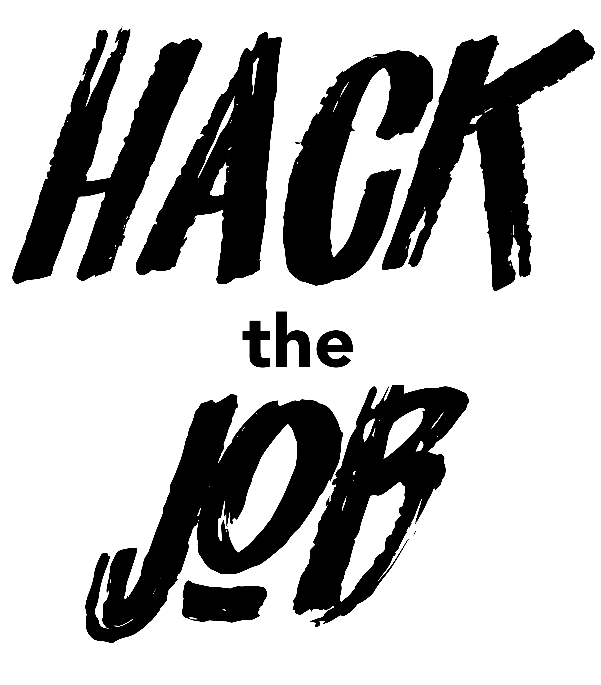
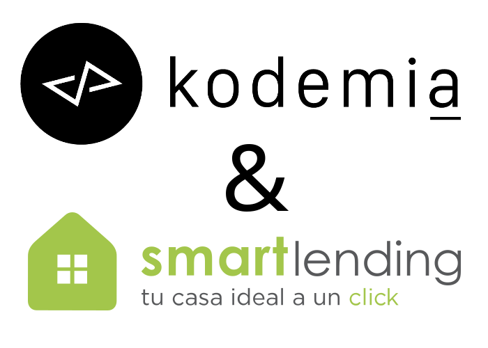

  

  

# Convocatoria: Front-End Developer Angular 6 o superior

### **Si buscas retos y no sólo un trabajo ¡esto es para ti!**

Participa en la nueva convocatoria para el siguiente **Hack de Job by Kodemia y SmartLending**.

Si consideras que eres todo un Front-End con Angular 6 o superior te invitamos a participar en esta nueva edición de Hack de Job y formar parte del gran equipo de trabajo de **Smart Lending**, empresa que está innovando la industria hipotecaria digital para hacerla más transparente, rápida y flexible.

¡Lo mejor de este evento es que **se lleva a cabo en un solo día todo el proceso de reclutamiento**, podrás demostrar tu talento en conjunto con otros candidatos a través de un reto en el cual presentarás el resultado de dicho reto como lo harías en un hackathon, así como poder platicar directamente con los líderes y fundadores de la empresa para conocer a detalle las tecnologías  y mejores prácticas con las que trabajan y, **al candidato ganador, se le hará una oferta laboral y económica final!**

Tu lugar de trabajo será en la zona de Polanco. El horario es de **9:00 a 6:00 pm** pero flexibles ya que lo importante es cumplir con los objetivos. 

La oferta económica parte de una base de **$30, 000.00 MXN mensuales netos (muy negociables de acuerdo a tu perfil)** en nómina 100% con prestaciones de ley, prestaciones superiores, tarjetas para diversos beneficios y la apertura de tomar capacitaciones de manera interna y externa.

Además, en SmartLending se cuenta con un excelente ambiente de trabajo, puedes ir vestido como te sientas más cómodo y una vez al mes se realiza un *viernes social* para salir con todo el equipo y convivir.

# ¡Buscamos talento, NO títulos!

## **La experiencia que necesitas para aplicar a este reto es:**

* Angular 6 o superior
* HTML/CSS
* Bootstrap, Materialize o Foundation
* Javascript
* UX/UI
* Estructuración de código
* Mobile First Design
* 4 años de experiencia (recomendada pero se evaluara el tiempo y calidad del proyecto)
 
## **Tus habilidades soft:**

* Lógica de programación
* Capacidad para trabajar en un equipo multidisciplinario
* Debes ser autodidacta
* Tener Ownership que es el sentido de pertenencia hacia un proyecto
* Adaptabilidad
* Compromiso
* Análisis de problemas
* Toma de decisiones
* Planeación y organización
* Adaptabilidad
* Comunicación oportuna y efectiva
* Seguimiento y control

Buscamos atraer, desarrollar y retener a gente joven y excepcional donde serás parte de los logros y crecimiento de la empresa.

Tu lugar de trabajo será un lugar en donde surgen las ideas y muy céntrico. **El horario es de 9:00 a 6:00pm** pero flexibles ya que lo importante es cumplir con los objetivos.

## ¿Que tengo que hacer?

1. Resuelve el Reto para participar en el evento
2. Guarda los resultados en tu repositorio preferido
3. Envía un mail a Areli Díaz ( areli@kodemia.mx ) con:
    * URL de tu repositorio
    * Curriculum Vitae
    * Teléfono de contacto
    * Cuéntanos un poco por qué te gustaría pertenecer al equipo de SmartLending
4. Tienes hasta el **miercoles 24 de julio a las 23:59 para enviar el email**
5. **Hack the job se llevará a cabo en nuestras oficinas en la colonia Roma el día sábado 27 de Julio de 9:00 am a 6:00 pm.**

Además habrá donas, pizza, café y cervezas ¡Nunca habías participado vivido un proceso de selección así!

# El Reto

1. Tendrás que consumir el API de GitHub para obtener los repositorios de un usuario de github.
2. Realizar el maquetado funcional del siguiente wireframe:  https://preview.uxpin.com/ef2dcc9a1dd957ed3d5f93e346c9d91edd061eb3#/pages/114086816/simulate/no-panels?mode=i con las respuestas del API de GitHub.
3. Puedes utilizar Bootstrap, Materialize o Foundation, con el que mayor experiencia tengas y Angular por supuesto
 
## Notas

* Si hay algo que no esté claro, toma una decisión y documenta por qué lo resolviste de esa manera.
* No importa si no terminas, queremos ver tus métodos y la forma de resolver el reto. *Realiza el reto y envía un mail adjuntando tu CV y un link a tu repositorio con tus resultados a Areli Díaz (areli@kodemia.mx), tienes hasta el 24 de Julio para enviar tu solución al reto.
* Recibirás un mail confirmando tu participación en el evento y los siguientes pasos. **¡Kodemia te desea todo el éxito!**

# Acerca de SmartLending

Smart Lending, como otras aplicaciones y empresas de tecnología en el mundo, nace a partir de encontrar una solución para mejorar, modernizar y actualizar la forma en que los procesos y trámites se hacían en el pasado.

En nuestro caso, el trámite anticuado de un crédito hipotecario del cual es común escuchar frustraciones al momento de asistir innumerables veces a una sucursal a entregar o recibir papeleo o bien al no tener una respuesta ágil que permita al comprador tomar una decisión sobre la compra de su inmueble y problemas con la tecnología.

Por esta razón, enfocamos nuestro esfuerzo en resolver una sola pregunta: Considerando un alto grado de conocimientos tecnológico, digitalización de operaciones, atención al servicio al cliente y un nivel sofisticado en términos financieros.

**¿Cómo sería la hipotecaria del futuro?**
